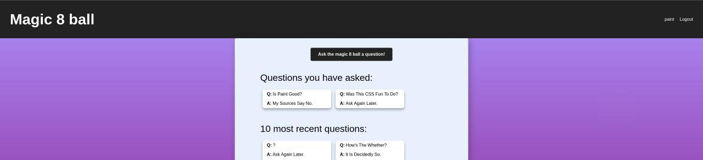
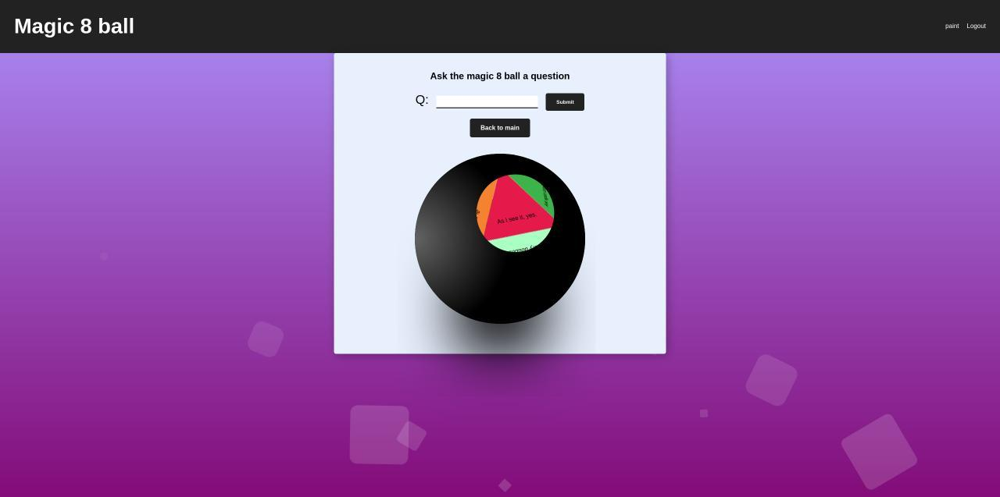

# Capstone 3 - Magic 8 ball
*the magic 8 ball we all know and love, online!*

#### Live link: https://magic-8.vercel.app/    
#### Client repo: https://github.com/Aelof3/magic8ball  
#### Server repo: https://github.com/Aelof3/magic8ball-api  

___

___  
#### How to use:
* Create an account
* Login to your account
* View the questions recently asked by everyone
    

* Look over all the questions you have asked
* Click the button at the top to ask the magic 8 ball a question
* Ask the magic 8 ball a question
    
* The magic 8 ball will magically spin to show you the prophetic answer to your question!

___
#### Technologies used:
* Front end: React, HTML, CSS
* Back end: Node, Express
* Database: Postgresql
___
